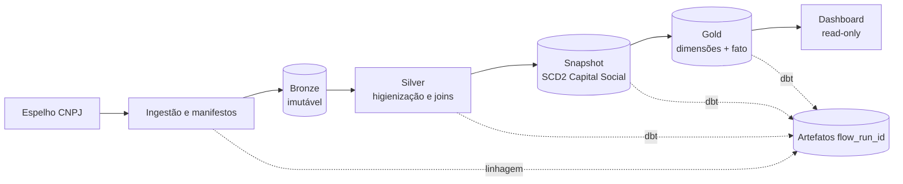

<!-- synced from https://github.com/devzurc/franq-data-lakehouse-challenge on 2026-09-11 -->

# GOV.BR CNPJ Lakehouse

Pipeline local-first para o Cadastro Nacional da Pessoa Jurídica (dados.gov.br): espelho público → Prefect → Bronze → dbt Silver → snapshot SCD2 → Gold → testes → dashboard. Dados são baixados somente no runtime e nunca entram no Git.

O dashboard mostra **agregações Gold** (UF, CNAE, totais). Ele **não** lista CNPJ, Bronze, Silver nem linhas brutas. As camadas se conferem com `./scripts/docker.sh verify` (contagens).

## Índice

- [1. Instalar Docker](#1-instalar-docker)
- [2. Subir o stack](#2-subir-o-stack)
- [3. Ensaio rápido (sintético)](#3-ensaio-rápido-sintético)
- [4. Ingestão oficial (10.000 empresas)](#4-ingestão-oficial-10000-empresas)
- [5. O que acontece em cada camada](#5-o-que-acontece-em-cada-camada)
- [6. Validar e visualizar](#6-validar-e-visualizar)
- [7. Repetir e desligar](#7-repetir-e-desligar)
- [8. Desenvolvimento nativo (opcional)](#8-desenvolvimento-nativo-opcional)



## 1. Instalar Docker

| Sistema | Instalação |
| --- | --- |
| Windows | [Docker Desktop](https://docs.docker.com/desktop/setup/install/windows-install/) |
| macOS | [Docker Desktop](https://docs.docker.com/desktop/setup/install/mac-install/) |
| Linux | [Docker Desktop](https://docs.docker.com/desktop/setup/install/linux/) ou [Docker Engine](https://docs.docker.com/engine/install/) |

Abra o Docker Desktop ou inicie o serviço e confirme:

```bash
docker --version
docker compose version
```

No WSL, habilite `Settings → Resources → WSL Integration` para a sua distribuição. Se `docker: command not found`, `./scripts/docker.sh` tenta `docker.exe`. No PowerShell use `scripts/docker.ps1`.

## 2. Subir o stack

Na pasta do clone:

```bash
./scripts/docker.sh start
```

A **primeira** execução constrói a imagem (pode levar vários minutos). Espere até abrir [Prefect UI](http://127.0.0.1:4200/) e [Dashboard Gold](http://127.0.0.1:8501/). A UI chama a API em `/api` no mesmo origin (`localhost` ou `127.0.0.1`). O dashboard fica vazio até um flow **COMPLETED** gravar Gold.

Há dois caminhos a partir daqui:

| Caminho | Comando / UI | Fonte | Tempo típico | Quando usar |
| --- | --- | --- | --- | --- |
| Ensaio | `./scripts/docker.sh demo` | 3 empresas sintéticas | minutos | Ver Prefect, camadas e dashboard sem baixar o espelho |
| Entrega | deployment `govbr-cnpj-lakehouse/monthly-ingest` | 10.000 empresas no espelho público | da ordem de horas (download + ranking; um mês oficial mediu ~2h26) | Amostra do desafio |

Não use o warehouse do ensaio sintético para o backfill oficial (`S12-01`, ainda bloqueado).

## 3. Ensaio rápido (sintético)

```bash
./scripts/docker.sh demo
./scripts/docker.sh verify
```

`demo` gera ZIPs claramente sintéticos, dispara o mesmo deployment Prefect e espera o run terminar. `verify` confere Bronze (3 empresas), Gold, o contrato analítico **sem imprimir linhas** e o inventário (`plan`: 32 ZIPs presentes, Bronze `reuse_bronze`). Uma segunda `demo` deve reutilizar a Bronze (`skipped: already ingested`) sem baixar o espelho.

## 4. Ingestão oficial (10.000 empresas)

Com o stack no ar, na Prefect UI:

1. Abra [http://127.0.0.1:4200/](http://127.0.0.1:4200/).
2. Vá em **Deployments**.
3. Abra **`govbr-cnpj-lakehouse` / `monthly-ingest`**.
4. **Run** (Quick run). Sem `source_period`, o lote é o **mês calendário anterior**, não o ensaio `202601` do dashboard. Não precisa preencher `source_dir`: a fonte padrão é o espelho remoto, amostra 10.000 em 1 job. Arquivos já no volume não são baixados de novo; se `202601` já tem 3 empresas sintéticas, um run oficial de 10.000 **no mesmo mês** é recusado (warehouse misturado). Use `docker compose down -v` só se quiser um warehouse vazio.

O run `lakehouse-…` resolve o lote, valida ZIPs, amostra, carrega Bronze e executa dbt (Silver, snapshot, Gold, testes). Acompanhe as tarefas `executar-dbt-silver|snapshot|gold|testes`. Enquanto o estado não for `COMPLETED`, o dashboard em [http://127.0.0.1:8501/](http://127.0.0.1:8501/) permanece vazio ou na partição anterior.

Paralelismo já existente (ADR-014): até 3 streams de download e `GOVBR_CNPJ_INGESTION_WORKERS=2` no ranking por arquivo. Bronze e dbt continuam sequenciais num único DuckDB. Não há Spark/Dask.

Para 20.000 CNPJs distintos, defina `GOVBR_CNPJ_SAMPLE_SIZE=5000` e `GOVBR_CNPJ_PARALLEL_JOBS=4` no `.env` ao lado do Compose, então `./scripts/docker.sh stop` e `start`.

## 5. O que acontece em cada camada

| Camada | Tratamento | Regra de negócio | Como conferir |
| --- | --- | --- | --- |
| Ingestão | Descoberta, SHA-256, manifestos, ZIP. | Só dados íntegros avançam. | Prefect + `verify` |
| Bronze | Carga append-only; CNPJ como string. | `sample_id` torna rerun idempotente. | `verify` (contagens; sem linhas) |
| Silver | Normalização, joins, nulos observáveis. | Relacionamentos preservados; documentos de sócio são pseudônimos. | dbt no Prefect; não aparece no dashboard |
| Snapshot | SCD Tipo 2 do Capital Social. | Uma versão corrente por empresa. | dbt snapshot no Prefect |
| Gold | Dimensões + fato por `reference_date`. | Lote ativo = `source_period + sample_id`. | Dashboard + `verify` |
| Dashboard | DuckDB read-only, só Gold. | Totais, UF e CNAE; sem CNPJ. | http://127.0.0.1:8501/ |

## 6. Validar e visualizar

```bash
./scripts/docker.sh verify
./scripts/docker.sh logs
```

No dashboard: escolha a partição Gold; veja métricas, gráfico por UF, tabela por CNAE e o catálogo de domínio. Artefatos dbt ficam no volume `govbr_cnpj_runtime`, por `flow_run_id`. Contrato: [analytics-consumption.md](project/specifications/analytics-consumption.md).

Prova de clone limpo (filesystem Linux nativo, cache `uv` já populado):

```bash
UV_OFFLINE=1 uv sync --all-groups --locked
uv run python scripts/validate_project_structure.py
uv run ruff check .
uv run pytest -q
./scripts/docker.sh start
./scripts/docker.sh demo
./scripts/docker.sh verify
```

`UV_OFFLINE=1` com cache populado prova que o ensaio não resolveu dependências na rede; não prova instalação air-gapped com cache vazio.

## 7. Repetir e desligar

```bash
./scripts/docker.sh run       # lembra de disparar monthly-ingest na UI
./scripts/docker.sh status
./scripts/docker.sh stop      # para containers, preserva volumes
```

O mesmo lote não duplica Bronze nem rebaixa ZIPs presentes. Contra o ensaio, confira com `uv run govbr-cnpj plan --source-period 202601 --sample-size 3` (`reuse_bronze`, 32 ZIPs). Sem `--sample-size` o padrão é 10.000 e o plano de `202601` após o demo mostra `conflict`. No container: `./scripts/docker.sh verify`. `stop` **não** apaga `govbr_cnpj_runtime` nem `govbr_cnpj_prefect_state`. Para um warehouse vazio de verdade: `docker compose down -v` (apaga Prefect state e DuckDB locais).

## 8. Desenvolvimento nativo (opcional)

Python 3.12 e `uv`:

```bash
uv sync --all-groups --locked
export GOVBR_CNPJ_RUNTIME_ROOT="$HOME/.local/share/govbr-cnpj-lakehouse"
./scripts/local.sh start
```

Dispare na Prefect UI ou com `./scripts/local.sh run`. Backfill anual (runtime isolado; **não** o share sintético):

```bash
unset GOVBR_CNPJ_RUNTIME_ROOT
./scripts/backfill.sh 2026
```

Isso grava em `$HOME/.local/share/govbr-cnpj-lakehouse-official`. `S12-01` permanece bloqueado até a série anual terminar.

## Segurança e limites

- Prefect e dashboard só em `127.0.0.1`.
- Dados, DuckDB, logs e artefatos ficam fora do Git.
- Não há provisionamento GCP neste repositório; o documento FinOps é design, não deploy.

## Referências

- [Runbook de análise local](docs/local-analytics-runbook.md)
- [Arquitetura](project/specifications/architecture.md)
- [Execução local](project/specifications/local-execution.md)
- [Fluxo Prefect](project/specifications/prefect-flow.md)
- [FinOps BigQuery](docs/finops-bigquery-architecture.md)
- [Índice de sprints](project/delivery-history.md)
- [ADR-012 nomes](project/decisions/ADR-012-govbr-lakehouse-naming.md)
- [ADR-016 forma do repositório](project/decisions/ADR-016-delivery-repository-shape.md)